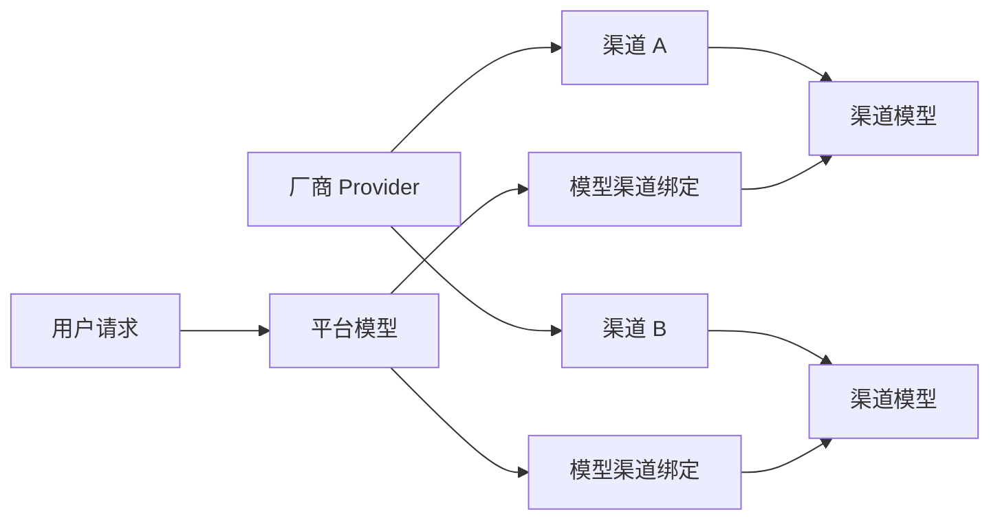

# 像素引擎业务需求与领域设计

本文档用于整理像素引擎（PixelEngine）的平台化改造需求，作为产品设计、数据库设计、后端 API 和前端改造的共同基线。

已确认需求以 [confirmed-requirements.md](./confirmed-requirements.md) 的覆盖式快照为准；现有前端的平台化处置结论见 [frontend-feature-audit.md](./frontend-feature-audit.md)。

当前确定的后端技术栈为 FastAPI + PostgreSQL。本文档先定义业务边界和核心关系，不直接锁定具体支付服务、邮件服务或部署平台。

## 1. 产品目标

将当前以浏览器直连上游 API 为主的图片生成工具，升级为具备账户、充值、统一模型供应和外部 API 能力的平台。

平台需要提供：

- 邮箱注册、登录、邮箱验证和密码找回。
- 用户额度账户和充值能力，初期按人民币与额度 1:1 兑换。
- 对 Google、xAI、OpenAI 等厂商图片模型的统一接入。
- 超级管理员管理厂商、渠道、模型池和用户价格。
- 用户通过网页选择平台模型生成图片。
- 用户创建绑定厂商的 API Key，通过平台 API 对外调用图片模型。
- 每次生成都经过后端鉴权、计费、渠道路由和结果记录。

## 2. 角色与权限

### 2.1 普通用户

普通用户可以：

- 使用邮箱注册、验证邮箱、登录和找回密码。
- 查看可用额度、充值订单和额度流水。
- 查看平台已上架的图片模型及价格。
- 在网页端选择模型并发起图片生成或编辑。
- 创建、查看名称、禁用和删除自己的 API Key。
- 创建 API Key 时绑定一个厂商。
- 使用 API Key 调用该厂商下已进入模型池且已启用的模型。
- 查看自己的生成记录和 API 调用记录。

普通用户不能：

- 查看渠道的真实 Base URL 和上游 API Key。
- 调用未进入模型池、已下架或不属于 API Key 绑定厂商的模型。
- 修改模型价格、渠道优先级或其他用户的额度。

### 2.2 超级管理员

超级管理员可以：

- 查看和管理用户状态。
- 调整用户额度，但必须产生管理员调整流水和审计记录。
- 创建、编辑、启用和停用厂商。
- 在厂商下创建一个或多个上游渠道。
- 配置渠道 Base URL、API Key、超时、优先级等信息。
- 测试渠道连接并手动拉取渠道最新模型。
- 将渠道中的图片模型绑定到平台模型池。
- 设置平台公开模型 ID、显示名称、价格、排序和启用状态。
- 为同一个平台模型绑定多个可用渠道，配置优先级或权重。
- 配置、启用和停用 EPay 支付渠道。
- 查看生成请求、渠道错误、消费流水和支付订单。

初期只设置 `user` 和 `super_admin` 两种角色。后续确有运营分工时，再增加只读管理员或运营角色。

## 3. 核心术语

### 3.1 厂商 Provider

厂商表示模型能力和 API 协议的归属，例如：

- `openai`：GPT Image 系列。
- `google`：Banana / Nano Banana 等图片模型系列。
- `xai`：Grok 图片模型系列。

厂商负责定义：

- 平台内部唯一标识。
- 展示名称和图标。
- 使用哪种请求适配器。
- 支持的图片生成、图片编辑和异步任务能力。

厂商不是具体的上游账号，也不直接保存 API Key。

### 3.2 渠道 Channel

渠道表示平台实际调用的一个上游连接，必须绑定一个厂商。

渠道包含：

- 所属厂商。
- 渠道名称。
- Base URL。
- 加密保存的上游 API Key。
- 启用状态。
- 请求超时。
- 路由优先级或权重。
- 最近一次连通性测试结果。
- 最近一次模型同步时间。

同一个厂商可以配置多个渠道。例如 OpenAI 厂商下可以同时存在官方渠道、国内代理渠道和备用渠道。

### 3.3 渠道模型 Channel Model

渠道模型是从某个渠道手动拉取或手动录入的上游模型记录。

渠道模型保存上游返回的原始模型 ID，例如：

- `gpt-image-1`
- `gpt-image-2`
- Google 图片模型的具体模型 ID
- Grok 图片模型的具体模型 ID

渠道模型只代表“这个渠道声称支持该模型”，不能直接被普通用户调用。

### 3.4 平台模型 Model Pool Entry

平台模型是加入模型池后，对普通用户和外部 API 公开的逻辑模型。

平台模型包含：

- 平台内部 UUID。
- 对外公开的模型 ID。
- 所属厂商。
- 显示名称和说明。
- 图片生成或编辑能力。
- 用户销售价格。
- 排序和启用状态。
- 可选的参数限制和默认参数。

只有启用的平台模型可以被用户调用。

### 3.5 模型渠道绑定 Model Channel Binding

模型渠道绑定负责把平台模型映射到一个或多个渠道模型。

每条绑定包含：

- 平台模型 ID。
- 渠道 ID。
- 渠道中的真实上游模型 ID。
- 启用状态。
- 路由优先级或权重。
- 可选的渠道成本价。

同一个平台模型绑定多个渠道后，可以实现故障切换和流量分配。平台对外模型 ID 不随上游渠道变化。



## 4. 主要业务流程

### 4.1 邮箱注册与登录

建议流程：

1. 用户提交邮箱和密码注册。
2. 系统创建待验证用户并发送邮箱验证码或验证链接。
3. 用户完成邮箱验证后激活账户。
4. 用户登录后获得短期访问令牌和可撤销的刷新会话。
5. 忘记密码时，只能通过邮箱验证重置。

安全要求：

- 邮箱统一转换为小写并建立唯一索引。
- 密码使用 Argon2id 等可靠算法哈希，不能加密后保存明文密码。
- 登录、注册、验证码和密码重置接口需要限流。
- 刷新会话需要支持主动退出和管理员强制失效。
- 超级管理员登录和关键操作建议后续增加二次验证。
- 超级管理员不能通过公开注册接口创建，应通过初始化命令或受控后台流程授予。

### 4.2 额度充值

初期兑换比例：

- 1 元人民币 = 1 平台额度。
- 支付协议统一使用 EPay 标准协议格式。
- EPay 商户信息由超级管理员在管理后台配置。

标准流程：

1. 用户选择充值金额。
2. 后端创建充值订单，状态为 `pending`。
3. 后端读取当前启用的 EPay 配置，生成平台订单号和签名参数。
4. 前端跳转到 EPay 收银台或展示 EPay 返回的支付地址。
5. EPay 通过服务端异步通知回调支付结果。
6. 后端验证商户 ID、签名、订单号、支付状态和金额。
7. 后端使用平台订单号及 EPay 交易号做幂等检查。
8. 在同一个数据库事务中更新订单、增加额度并写入额度流水。
9. 前端轮询订单状态并刷新余额。

不能依赖前端“支付成功”跳转来增加额度。支付回调重复到达时，只能入账一次。

#### 4.2.1 EPay 管理员配置

超级管理员需要配置：

- 配置名称。
- EPay 网关地址。
- 商户 ID，即标准协议中的 `pid`。
- 商户密钥，必须加密保存且不能通过查询接口明文返回。
- 签名类型，首版按 EPay 标准协议使用 `MD5`。
- 允许用户选择的支付类型，例如支付宝、微信支付。
- 启用状态。

MVP 同一时间只允许启用一个 EPay 配置。管理员启用新配置时，应明确停用旧配置；历史订单仍保存创建订单时使用的支付配置 ID。

回调地址和同步跳转地址由后端根据系统公开地址生成，不允许管理员或普通用户为单笔订单传入任意回调地址。

#### 4.2.2 EPay 标准参数

创建支付时至少使用以下标准字段：

```text
pid
type
out_trade_no
notify_url
return_url
name
money
sign
sign_type
```

异步通知按 EPay 标准协议读取并验证 `pid`、`trade_no`、`out_trade_no`、`type`、`money`、`trade_status`、`sign` 和 `sign_type` 等字段。只有签名正确、订单金额完全一致且状态为支付成功时才能入账。

### 4.3 管理员创建渠道并加入模型池

1. 管理员选择或创建厂商。
2. 在厂商下创建渠道，填写 Base URL 和 API Key。
3. 后端使用厂商适配器测试连接。
4. 管理员点击“拉取模型”，后端从上游获取最新模型列表。
5. 后端更新该渠道的渠道模型快照，但不自动对用户开放。
6. 管理员选择其中的图片模型加入模型池。
7. 如果平台中已存在相同逻辑模型，则新增渠道绑定；否则创建新的平台模型。
8. 管理员设置公开模型 ID、显示名称、销售价格和启用状态。
9. 模型启用后出现在用户模型列表中。

### 4.4 网页端生成图片

1. 前端调用平台模型列表接口。
2. 参数栏展示平台模型选择器，而不是渠道或真实上游配置。
3. 默认选择用户上次成功选择的模型。
4. 用户提交提示词、参考图和生成参数。
5. 后端验证登录状态、模型状态、参数和可用额度。
6. 后端保存本次价格快照并扣减或预占额度。
7. 路由服务从模型的可用渠道绑定中选择渠道。
8. 厂商适配器转换请求并调用上游。
9. 成功后记录结果并完成结算；失败且没有可用备用渠道时退回额度。
10. 前端继续使用现有画廊展示生成结果。

用户上次选择的模型建议保存在用户偏好中，浏览器本地再保留一份缓存。登录其他设备时以服务端偏好为准。

### 4.5 外部 API Key 调用

用户创建 API Key 时必须选择厂商。API Key 创建后：

- 原始 Key 只显示一次。
- 数据库只保存 Key 哈希、前缀、名称、厂商和状态。
- Key 可以被用户主动禁用或删除。
- 请求中的模型必须属于 Key 绑定厂商。
- 请求中的模型必须是已启用的平台模型。
- 额度从 Key 所属用户的账户扣除。

建议提供 OpenAI 风格的图片接口作为统一外部协议，例如：

```text
POST /v1/images/generations
POST /v1/images/edits
```

外部调用传入平台公开模型 ID。后端根据模型所属厂商选择 Google、xAI 或 OpenAI 适配器，外部用户不接触渠道信息。

## 5. 模型路由规则

MVP 建议先使用简单、可解释的路由方式：

1. 过滤已停用渠道和已停用模型绑定。
2. 按管理员配置的优先级排序。
3. 选择优先级最高且健康的渠道。
4. 遇到明确的渠道错误时，按顺序尝试备用渠道。
5. 参数错误、内容审核拒绝等确定性错误不应无条件重试其他渠道。

后续有实际流量后，再增加权重随机、并发限制、熔断、成本优先和延迟优先策略。初期不需要设计复杂的动态调度系统。

## 6. 计费规则

### 6.1 价格定义

建议区分两个概念：

- 销售价格：用户实际支付的额度，配置在平台模型上。
- 渠道成本价：可选，用于利润统计，配置在模型渠道绑定上，不影响用户扣费。

管理员修改价格后，只影响新创建的生成请求。每个生成请求必须保存提交时的价格快照，避免历史记录随当前价格变化。

### 6.2 计费单位

计费单位确定为“一张请求输出图片”。每次请求的消费额度按模型单价乘请求图片数量计算：

```text
应扣额度 = 模型单价 × 请求图片数量
```

如果某个上游只支持单图，后端可以拆成多个上游请求，但用户价格仍按请求图片数量计算，而不是按内部重试次数计算。

### 6.3 扣费与退款

建议 MVP 使用“先扣费，失败补偿退款”：

1. 在 PostgreSQL 事务中锁定用户额度账户。
2. 检查可用额度。
3. 扣减额度并写入 `generation_charge` 流水。
4. 调用上游渠道。
5. 全部失败时写入独立的 `generation_refund` 流水并退回额度。

部分成功时，应按成功和失败的输出数量结算。所有额度变化都必须通过流水完成，不能只修改用户余额字段。

## 7. 必须保持的业务不变量

- 未进入模型池的模型不能被普通用户调用。
- 已停用的平台模型或渠道不能接收新请求。
- API Key 只能调用其绑定厂商下的模型。
- 渠道必须且只能属于一个厂商。
- 平台模型必须且只能属于一个厂商。
- 模型不能绑定到其他厂商的渠道。
- 任何额度变化都必须有不可变流水记录。
- 同一个支付回调或幂等键不能重复入账。
- EPay 回调的商户 ID、签名、订单金额和支付状态必须全部验证通过。
- 充值订单必须保存创建时使用的支付配置，历史订单不能跟随当前配置变化。
- 每个生成请求必须保存价格、计费数量和扣费金额快照。
- 上游 API Key 不能明文返回给前端，也不能明文写入日志。
- 用户 API Key 原文只在创建成功时显示一次。
- 普通用户不能通过提交原始 Base URL 绕过平台路由和计费。

## 8. PostgreSQL 核心数据模型

以下是逻辑表，不代表最终字段已经完全确定。

### 8.1 用户与认证

- `users`：邮箱、密码哈希、角色、状态、邮箱验证时间。
- `user_sessions`：刷新会话、过期时间、撤销时间、设备信息。
- `email_verifications`：邮箱验证令牌或验证码。
- `password_resets`：密码重置令牌或验证码。
- `user_preferences`：上次选择的平台模型等用户偏好。

### 8.2 额度与支付

- `wallet_accounts`：用户当前可用额度。
- `credit_ledger`：充值、生成扣费、退款、管理员调整等不可变流水。
- `payment_channels`：EPay 网关、商户 ID、加密商户密钥、支付类型和启用状态。
- `recharge_orders`：充值金额、兑换额度、支付配置、平台订单号、EPay 交易号和订单状态。
- `payment_events`：EPay 回调原始事件摘要、签名验证结果和幂等状态。

金额和额度不能使用浮点数。人民币金额建议以分为单位保存整数，额度和模型价格使用 PostgreSQL `numeric`。

### 8.3 厂商、渠道和模型

- `providers`：厂商标识、名称、适配器类型、状态。
- `channels`：厂商、Base URL、加密凭证、优先级、健康状态。
- `channel_models`：渠道拉取到的原始模型 ID 和元数据。
- `platform_models`：公开模型 ID、厂商、能力、销售价格、状态。
- `model_channel_bindings`：平台模型和渠道模型之间的路由关系。
- `channel_sync_runs`：模型同步执行记录和错误信息。

### 8.4 调用与密钥

- `user_api_keys`：用户、厂商、Key 哈希、前缀、名称和状态。
- `generation_requests`：用户、来源、模型、价格快照、状态和耗时。
- `generation_attempts`：每次渠道尝试、上游请求 ID、错误和耗时。
- `audit_logs`：管理员对价格、渠道、用户额度等敏感数据的操作记录。

## 9. 后端模块建议

后端目录建议按业务模块组织，不建立通用的巨大 service 或 repository 基类。

```text
backend/
├─ app/
│  ├─ main.py
│  ├─ core/
│  │  ├─ config.py
│  │  ├─ security.py
│  │  ├─ encryption.py
│  │  └─ errors.py
│  ├─ db/
│  │  ├─ session.py
│  │  └─ models/
│  ├─ modules/
│  │  ├─ auth/
│  │  ├─ users/
│  │  ├─ wallets/
│  │  ├─ payments/
│  │  ├─ providers/
│  │  ├─ channels/
│  │  ├─ models/
│  │  ├─ api_keys/
│  │  ├─ generations/
│  │  └─ admin/
│  └─ integrations/
│     ├─ email/
│     ├─ payment/
│     │  └─ epay.py
│     └─ image_providers/
│        ├─ openai.py
│        ├─ google.py
│        └─ xai.py
├─ migrations/
├─ tests/
├─ alembic.ini
└─ pyproject.toml
```

每个业务模块按实际复杂度包含 `router.py`、`schemas.py`、`service.py` 和 `repository.py`。简单模块不必为了目录整齐创建空层。

OpenAI、Google 和 xAI 已经是三个确定的图片厂商，因此适配器抽象是合理的。适配器只负责：

- 拉取和标准化模型列表。
- 把平台生成参数转换为厂商请求。
- 解析同步、流式或异步结果。
- 将厂商错误转换为平台统一错误。

适配器不负责用户鉴权、扣费或数据库事务。

## 10. API 草案

### 10.1 认证和用户

```text
POST /api/auth/register
POST /api/auth/verify-email
POST /api/auth/login
POST /api/auth/refresh
POST /api/auth/logout
POST /api/auth/forgot-password
POST /api/auth/reset-password
GET  /api/me
PATCH /api/me/preferences
```

### 10.2 模型、额度和充值

```text
GET  /api/models
GET  /api/wallet
GET  /api/wallet/ledger
POST /api/recharge-orders
GET  /api/recharge-orders/{order_id}
GET|POST /api/payments/epay/notify
GET      /api/payments/epay/return
```

### 10.3 网页生成和用户 API Key

```text
POST   /api/generations
GET    /api/generations/{request_id}
GET    /api/api-keys
POST   /api/api-keys
PATCH  /api/api-keys/{key_id}
DELETE /api/api-keys/{key_id}
```

### 10.4 外部兼容接口

```text
POST /v1/images/generations
POST /v1/images/edits
GET  /v1/models
```

`GET /v1/models` 只返回当前 API Key 所绑定厂商下可调用的平台模型。

### 10.5 管理员接口

```text
GET/POST/PATCH /api/admin/providers
GET/POST/PATCH /api/admin/channels
POST           /api/admin/channels/{channel_id}/test
POST           /api/admin/channels/{channel_id}/sync-models
GET            /api/admin/channels/{channel_id}/models
GET/POST/PATCH /api/admin/models
POST/DELETE    /api/admin/models/{model_id}/channels
GET/POST/PATCH /api/admin/payment-channels
GET/PATCH      /api/admin/users
POST           /api/admin/users/{user_id}/credit-adjustments
GET            /api/admin/generation-requests
GET            /api/admin/audit-logs
```

## 11. 前端改造范围

现有前端需要逐步增加：

- 注册、登录、邮箱验证和密码重置页面。
- 登录会话恢复和退出登录。
- 顶部用户菜单、额度余额和充值入口。
- 充值订单和额度流水页面。
- 超级管理员的 EPay 支付配置页面。
- 从后端加载的平台模型选择器。
- 在生成参数中增加平台模型 ID，并记住上次选择。
- 用户 API Key 管理页面。
- 超级管理员后台，包括厂商、渠道、模型池、价格和用户管理。
- 生成请求改为调用平台后端，不再向普通用户暴露上游 Base URL 和 API Key。

现有“用户自己填写上游 API Key 直连”的模式与平台计费模式存在冲突。建议后续明确二选一：

1. 普通用户只使用平台模型和平台额度，隐藏原有上游配置。
2. 保留独立的 BYOK 模式，但明确标记为不走平台额度，并与平台模式隔离。

不建议让普通用户在平台计费请求中继续传入任意 Base URL 或上游 API Key。

## 12. MVP 实施顺序

### 阶段一：账户和管理基础

- FastAPI、PostgreSQL、Alembic 和配置管理。
- 用户注册、邮箱验证、登录和超级管理员权限。
- 厂商、渠道、渠道测试和手动模型同步。
- 平台模型池和管理员价格配置。

### 阶段二：额度与网页生成

- 钱包账户和不可变额度流水。
- 超级管理员配置 EPay 网关和商户信息。
- EPay 充值订单、签名、异步通知和幂等入账。
- 网页端平台模型选择。
- 后端图片生成路由、扣费、失败退款和请求记录。

### 阶段三：外部 API

- 用户 API Key 生命周期管理。
- 厂商绑定和模型权限校验。
- OpenAI 风格的统一图片生成接口。
- API 调用日志和基础限流。

### 阶段四：运营和稳定性

- 多渠道故障切换和健康检查。
- 渠道成本与利润统计。
- 管理员审计日志。
- 告警、熔断、并发限制和更细粒度的退款策略。

## 13. 待确认事项

以下问题不影响当前领域划分，但需要在对应功能开发前确定：

- 邮件验证码使用哪个邮件服务。
- 注册是否完全开放，是否赠送初始额度。
- 图片生成部分成功时的具体计费和退款规则。
- 用户生成图片是否继续只保存在浏览器，还是增加对象存储和跨设备历史。
- 是否保留现有 BYOK 直连模式。
- 外部 API 是否只兼容 OpenAI Images API，还是同时提供平台自有任务接口。
- 异步模型是否在 MVP 中支持，是否需要独立任务队列和 Redis。
- 渠道路由初期使用固定优先级还是权重随机。
- 额度是否允许管理员配置小数精度、最低充值额和充值赠送活动。

## 14. 首版验收标准

- 新用户可以通过邮箱完成注册、验证和登录。
- 超级管理员可以配置并启用 EPay 网关、商户 ID、商户密钥和支付类型。
- 用户可以通过 EPay 完成一次真实充值，且重复支付回调不会重复增加额度。
- 管理员可以创建至少 OpenAI、Google、xAI 三个厂商及其渠道。
- 管理员可以从渠道拉取模型并将图片模型加入模型池。
- 管理员可以设置模型价格并启用或停用模型。
- 用户只能看到和调用已启用的平台模型。
- 网页端可以记住用户上次选择的平台模型。
- 多图请求的扣费金额等于模型单价乘请求图片数量。
- 生成前完成额度检查，成功后有扣费流水，失败后有退款流水。
- 用户可以创建绑定厂商的 API Key。
- API Key 无法调用其他厂商模型或未进入模型池的模型。
- 上游 API Key、用户 API Key 原文和密码不会出现在数据库明文字段或应用日志中。
